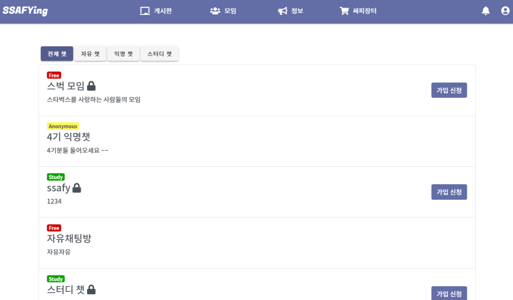
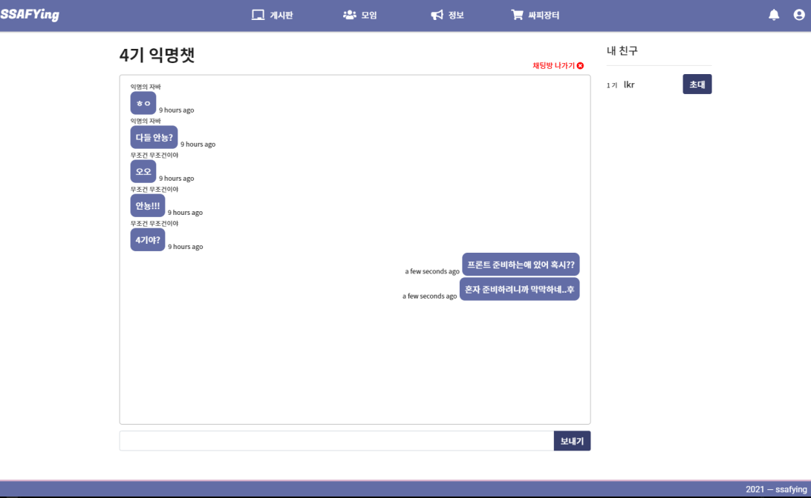

# ✨Today I Developed🤞


### ✔개발목표

> 오늘 계획한 개발 목표를 알려주세요

```
채팅방 밖 / 내부 UI 완성
```


### 👌개발 진행 상황

> 금일 개발한 목표에 대한 개발진행한 내용





```javascript
**채팅방 외부**
잠금방 - 자유/스터디 채팅방만 적용
	ㄴ 잠금방의 경우 방장(최초 채팅방 생성자)에게 가입승인 후 입장
공개방 - 자유/스터디/익명 채팅방 모두 가능

자유/스터디 - 자신의 nickname으로 입장
익명 - 들어갈 때 자신이 원하는 nickname설정 후 입장

**채팅방 내부**
사용 data - nickname/content/createdAt

좌측(채팅 컨테이너)
- 나의 채팅 - 우측
- 상대 채팅 - 좌측

우측(친구 목록)
- 잠금방의 방장인 경우 친구 초대 가능

+ UI변경사항
익명방의 경우 친구목록 X (익명방에는 굳이 초대가 필요없다는 판단)
```


### 🤷‍♂️개발이슈

> 개발 과정에서 발생한 이슈가 있다면 알려주세요

```
...
```


### 🐱‍🚀향후 개발 계획

> 금일 개발과정을 바탕으로 내일 혹은 금주에 개발이 필요한 내용을 알려주세요

```
기능/UI 고도화 및 안정화
```

