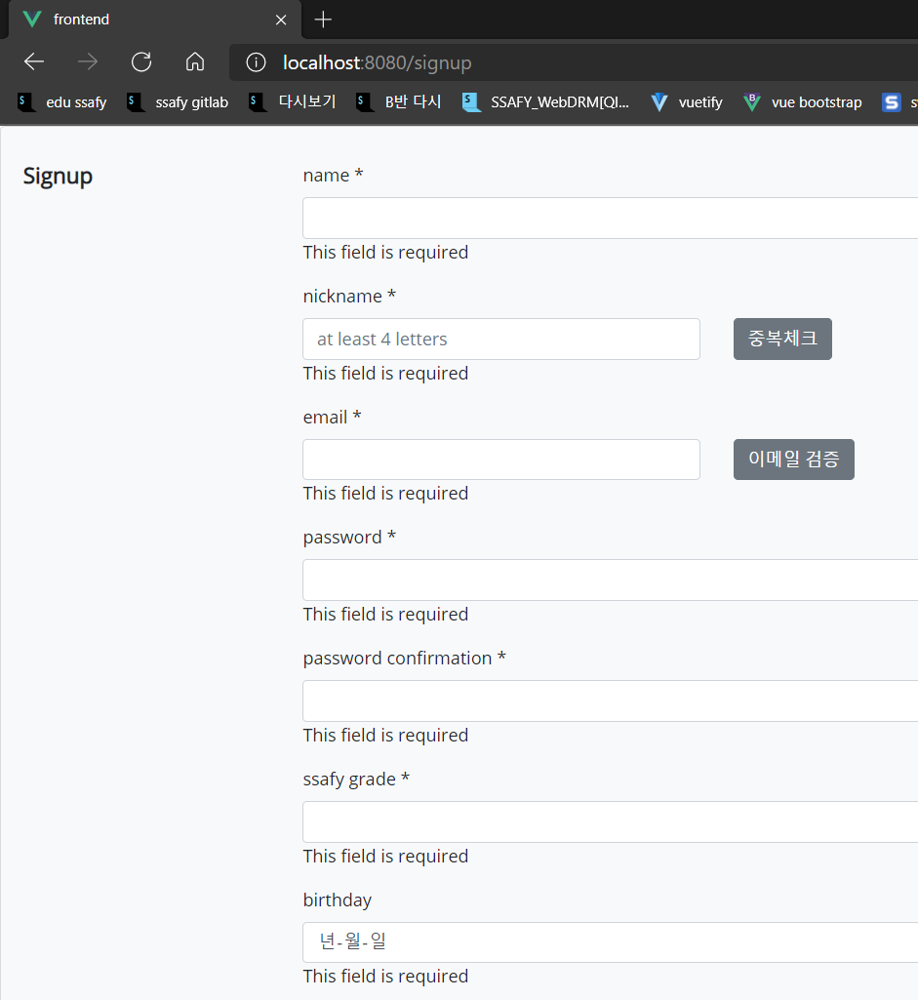

# ✨Today I Developed🤞


### ✔개발목표

> 오늘 계획한 개발 목표를 알려주세요

```
어제 못다한 회원가입 부분 구현
각 입력값들 컴포넌트화해서 구분
v-model을 활용해서 각 컴포넌트의 입력값을 하나로 도출
vee-validate이라는 라이브러리를 활용해서 벨리데이션 작업 진행
```


### 👌개발 진행 상황

> 금일 개발한 목표에 대한 개발진행한 내용

```
기본적인 입력과 입력값이 없을때 에러메시지 발생과 
벨리데이션 과정 하나의 유저 정보로 결합하는 것에는 성공
수완이의 요청에 따른 명찰을 찍어서 올리는 필드를 추가
```




### 🤷‍♂️개발이슈

> 개발 과정에서 발생한 이슈가 있다면 알려주세요

```
꾸미는 부분이랑 아직 테스트를 많이 안해봐서 유저 경험적인 측면에서 걸리는 부분들이 조금 있다.
```


### 🐱‍🚀향후 개발 계획

> 금일 개발과정을 바탕으로 내일 혹은 금주에 개발이 필요한 내용을 알려주세요

```
유저 로그인 부분 어떻게 하면 JWT구현할 수 있을지 연구해볼 계획이다.
```

