# ssafying


## 0. ssafying의 목표

> ssafy + shopping의 합성어로 `싸피 人`들을 위한 커뮤니티 공간을 개발하였습니다. 
>
> 프로님들과, 멘토님들 눈치 때문에 속 시원하게 이야기 하지 못했던 에듀싸피 익명게시판, 싸피인 인증을 통해 싸피 인만 접속가능한  **찐**익명게시판📕,  기수들간 단절되었던 소통의 장을 열어줄 `기수게시판`📑 , 지역 별 나눠진 싸피인들을 위한 해당 지역 🎁 `장터게시판`까지 이 외에도 취업정보, 스터디 게시판 등 다양한 게시판을 통해서 모두에게 플러스가 되는 싸피인의 커뮤니티를 꿈꿉니다.


## 1. ERD

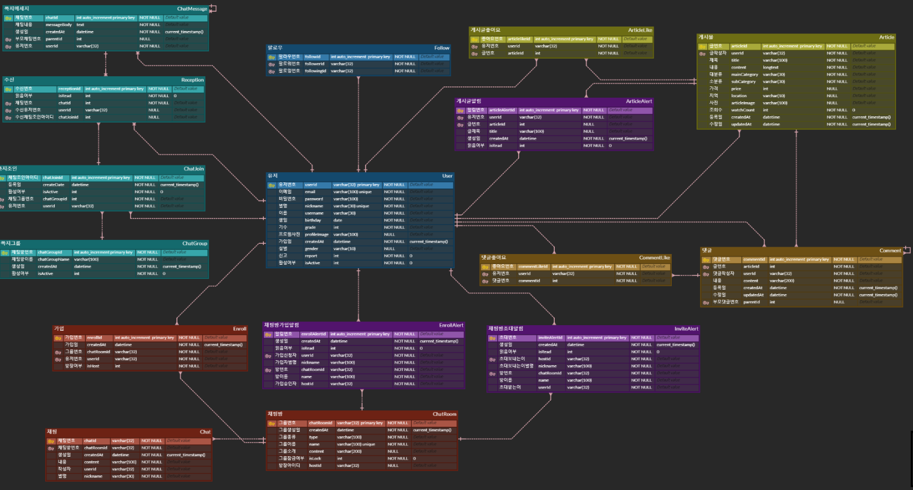


## 2. 기술스택

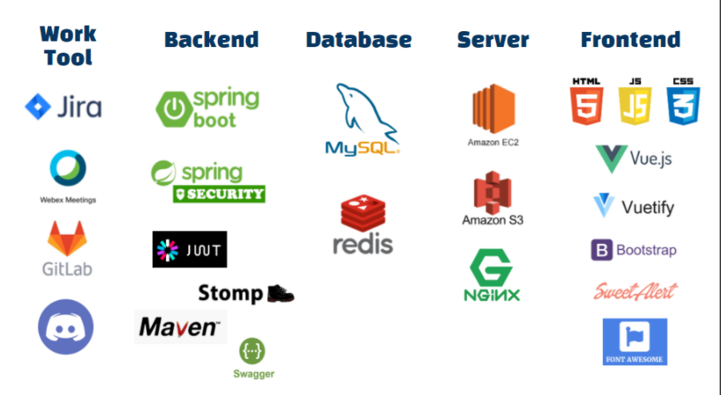

- 협업툴

  - gitlab
  - jira
  - webex
  - discord

- 백엔드

  - spring boot
    - spring security
    - jwt
    - spring websocket stomp
    - swagger
    - maven
    - mybatis

- 데이터베이스

  - MySql
  - redis

- Server

  - Aws EC2
  - Aws S3
  - Nginx

  **(참고: 로컬에서는 Docker를 이용하여 MariaDB와 redis를 사용하였습니다.)**

- 프론트앤드

  - HTML/JS/CSS
  - Vue
  - Vuetify
  - Bootstrap
  - Font Awesome
  - Sweet Alert(알람 모달)


## 3. 기능

- 회원가입

  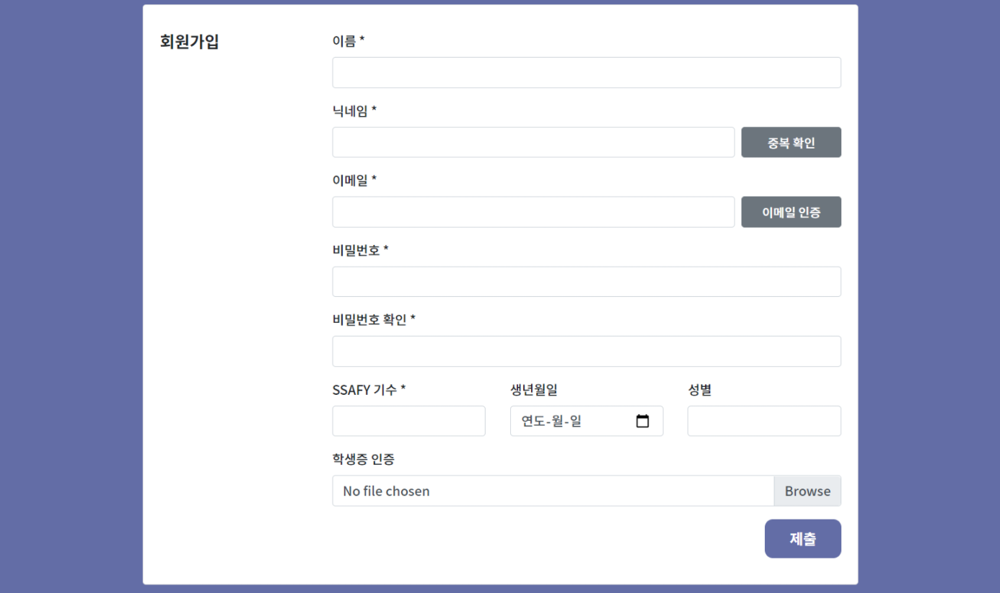

  ```
  닉네임의 중복을 확인할 수 있는 버튼과 인증 메일을 보낼 수 있는 버튼이 존재합니다. 
  또한 학생증 이미지 파일을 입력하면 axios를 통한 json 타입의 데이터로 주고 받기 위해 이를 string 타입으로 변환하고, 이를 Backend에서 받아 byte array로 변환하고 file 형태로 가공하여 지정된 AWS S3 버킷에 저장하고 url을 받아 DB에 저장합니다. 
  하지만 초기 회원가입시 어떠한 권한도 존재하지 않아, 권한이 부여되지 못한 사용자는 로그인과 회원가입 페이지 이외에는 들어올 수 없도록 Frontend에서 맊았으며, Backend 또한 spring boot security 프레임워크를 이용하여 권한이 없는 사용자에게 데이터를 넘겨주지 않도록 조치하였습니다.
  ```


- 관리자 페이지
  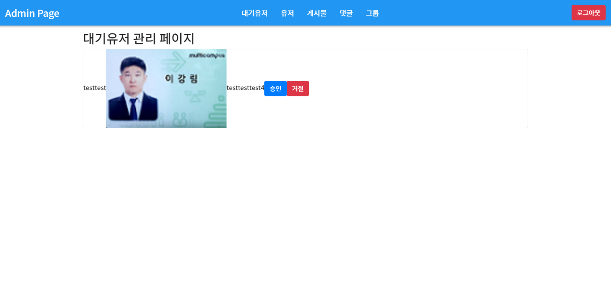

  ```
  ADMIN 권한을 가진 사용자만이 들어올 수 있는 페이지로 회원가입을 요청한 유저의 일부 데이터를 보여줍니다.
  이를 통해 관리자는 SSAFY 학생인지 판단하여 USER 권한을 부여할 수 있습니다.
  ```


- 로그인

  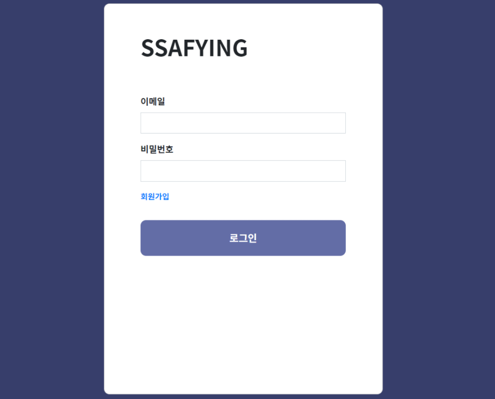

  ```
  이메일과 비밀번호를 입력받아 일치하는 데이터가 존재하면 JWT 토큰을 부여합니다.
  이때 이 JWT 토큰에는 만료시간, 권한, id가 존재하여 요청이 있을 때마다 이를 확인하여 리소스의 접근이 인가되었는지 인증합니다.
  ```


- 메인페이지

  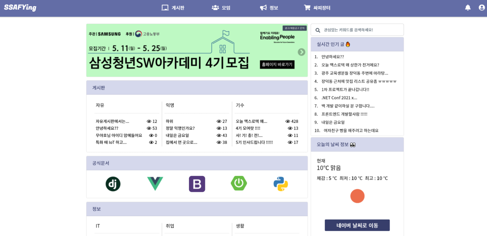

  ```
  최신 게시글과 인기게시글을 보여줍니다.
  이때 최신 게시글과 인기게시글은 모든 유저가 공통적으로 보는 사항으로 매번 DB에 접근하여 데이터를 선별하는 것은 트렌젝션에 부담된다고 판단하여, redis라는 cache 메모리 기반의 DB를 추가로 운영하였습니다. 이를 위해 간단한 get과 set 메서드를 구현하였고 특정 시간을 지정하여 스케줄링하여 데이터를 갱신하도록 하였습니다.
  ```


- 프로필 페이지

  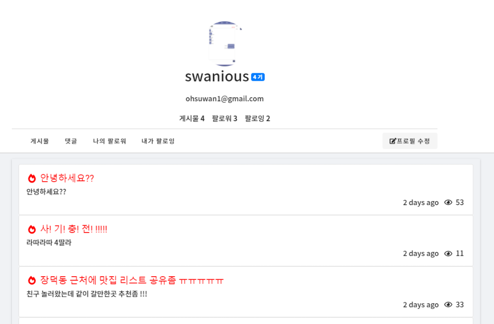

  ```
  유저 프로필 페이지에서 유저가 작성한 모든 글과 댓글, 팔로워와 팔로잉의 수를 볼 수 있습니다. 또한 자신의 프로필 페이지에서는 유저정보를 수정할 수 있습니다.
  타인의 프로필 페이지에 들어가면 팔로우 버튼을 통해 팔로워가 될 수도 있습니다.
  ```


- 게시판

  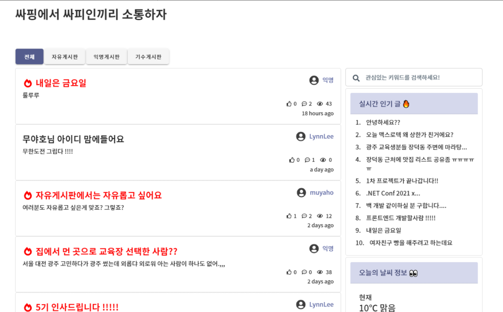

  ```
  각 서브카테고리 게시판에 접속하여 모든 유저는 게시글을 Create, Read할 수 있고 자신의 게시글만 Update, Delete할 수 있습니다. 게시글을 클릭하면 게시글의 디테일 페이지로 이동할 수 있습니다.
  또한 게시글의 조회수가 일정수 이상으로 증가하면 글의 제목을 강조해줍니다.
  ```


- 게시글

  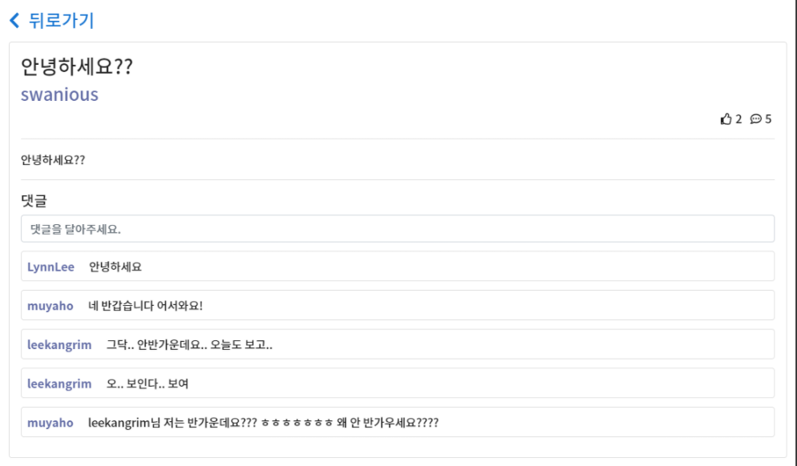

  ```
  각 게시글의 디테일 페이지에서는 모든 유저는 댓글을 Create, Read할 수 있고 자신의 댓글만 Update, Delete할 수 있습니다.
  ```


- 채팅방 목록

  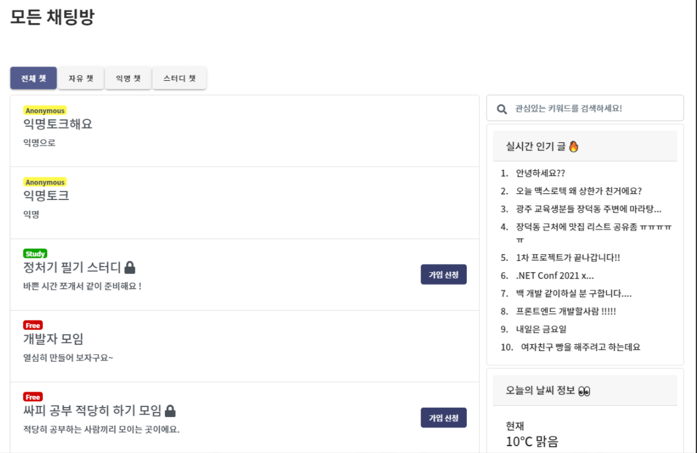

  ```
  채팅방의 분류의 종류에는 2가지가 존재합니다. 하나는 익명/실명, 다른 하나는 공개/비공개입니다. 
  익명으로 채팅방을 개설하면 채팅방을 입장할 때 사용할 익명을 입력받습니다. 
  비공개 채팅방을 개설하면 정해진 유저들만이 입장할 수 있습니다.
  ```


- 가입 요청 알림 / 초대 알림

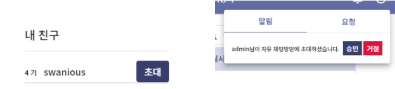

```
비공개 채팅방 옆에 존재하는 가입 신청을 통해 방장에게 실시간 알림이 전달되어 방장이 이를 승인하면 방에 입장이 가능해집니다. 또는 방장만의 초대 권한을 통해 방에 초대알림을 보내는 것이 가능합니다.
```


- 채팅방

  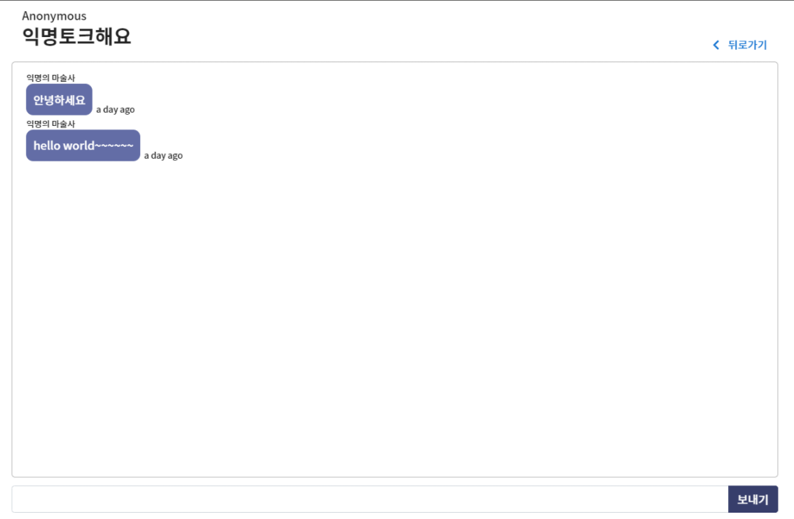

  ```
  채팅방에 입장하면 채팅메세지가 redis를 통해 100개만 전달됩니다. 하지만 유저가 이 이상의 채팅을 읽기 위해 스크롤을 올려 천장에 닫는다면 그때만 axios 요청을 통해 모든 채팅방의 채팅을 받아옵니다. 
  이때 읽고 있던 채팅의 위치가 변하지 않도록 위치를 계산하여 유지하도록 하였습니다.
  ```


- 검색 기능

  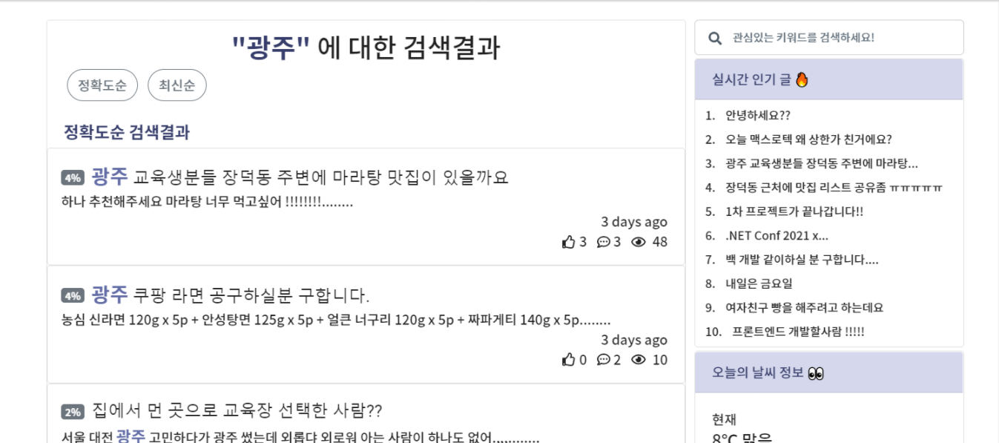

  ```
  검색어를 입력하면 2가지 종류의 검색결과를 얻을 수 있습니다.
  하나는 정확도순에 따른 검색결과 입니다. 이는 KMP 알고리즘을 적용하여 텍스트에 존재하는 검색어와 일치하는 단어들의 개수를 기준으로 하여 상위에 배치시켜줍니다.
  또 하나인 최신순은 말그대로 작성일에 따른 내림차순으로 검색결과를 보여줍니다.
  ```


## 4. 맡은 역할(이강림)

- ERD 모델링

  ```
  유저, 팔로우, 채팅, 채팅방, 알림, 게시글, 댓글, 좋아요 등의 테이블에 대한 초기 모델링을 담당하였습니다.
  ```

- 서버 구축

  - AWS EC2 서버 구축

    ```
    MobaXterm이라는 프로그램을 이용하여 EC2에 쉽게 접속할 수 있다는 지식을 팀원들과 공유하였으며, 
    AWS EC2 Ubuntu 서버에 MySql과 Redis, java, nginx, npm 등 프로그램를 설치하고 저희 팀 프로그램을 git을 통해 다운로드하여 초기 서버 환경을 구축하였습니다.
    ```
    
  - AWS S3 버킷 생성 및 연동

    ```
    이미지 파일을 업로드하기 위해서 직접 이미지파일을 DB에 저장할 수도 있었지만 용량과 입출력을 위한 인코딩과 디코딩에 서버 낭비가 예상되어 AWS S3을 이용하기로 하여 직접 버킷을 생성하고 연동하여 이미지를 JSON을 통해 String 형태로 받아와 byte array로 변환하고 이를 file 형태로 다시 변환하여 이미지 파일을 AWS S3에 저장하고 해당 url을 받아와 DB에 이를 저장하는 프로그램을 구현하였습니다.
    ```

- 빌드 및 배포
  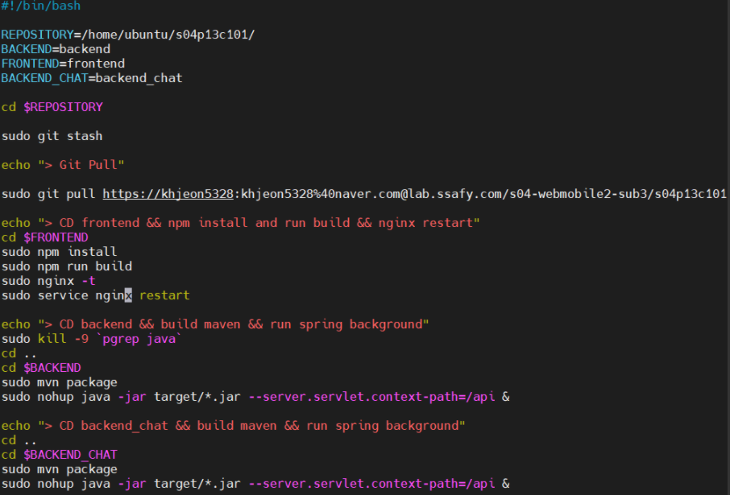

  ```
  배포를 위한 단순한 스크립트파일을 작성하여 모든 팀원들이 누구나 손쉽게 자동빌드와 배포를 동시에 수행할 수 있도록 하였습니다.
  또한 Nginx 기본 설정과 서버를 2개 동시에 운영하기 위한 파일 설정을 통해 배포 환경을 세팅하였습니다.
  ```

- 유저 관련 기능

  - 인증메일

    ```
    SMTP 라이브러리를 활용하여 인증메일을 구현하였습니다. 
    이때 오픈소스의 대부분은 JavaMailSender 클래스를 @Autowired 어노테이션을 통해 쉽게 사용하였지만, 정확한 원인을 찾지 못했지만 저희 프로그램에서는 이것이 불가능하여(에러발생) @Configuration을 붙인 직접 생성한 설정파일을 통해 JavaMailSender 클래스를 커스터마이징하여 사용하였습니다. 
    ```

  - Spring boot Security Framework

    ```
    유저와 관리자에 대한 인증과 인가를 Spring boot Security 프레임워크를 이용하여 구현하였습니다.
    이때 오픈소스의 대부분은 JPA를 이용한 코드였기 때문에 Mybatis를 이용한 저희 프로그램과 호환되지 못했습니다. 이를 위해 문제되는 UserDto에 role 컬럼을 추가하고 UserDetail 클래스를 CustomUserDetail로 커스터마이징하여 이를 설정파일에 등록하는 작업을 통해 문제를 해결할 수 있었습니다.
    ```

- JWT Token

  ```
    기존에 사용하던 JWT 토큰 발급 클래스를 Spring boot Security 프래임워크에 적용하기 위해 Intercept 클래스 대신 JwtRequestFilter를 생성하여 WebSecurityConfigurerAdapter를 상속받은 설정파일에 추가하였습니다.
  ```

- 실시간 채팅/알림

  - STOMP 라이브러리

    ```
    실시간 채팅과 알림을 구현하기 위해 socket 통신을 사용해야 했습니다. 이를 위해서는 Session을 직접 이용할 수도 있었지만 업무 리소스를 최소화하기 위해 STOMP 라이브러리를 사용하였습니다. 이를 위해 WebSocketMessageBrokerConfigurer를 상속받은 설정 클래스를 구현하고, 모든 채팅방과 모든 유저가 아닌 특정 채팅방과 특정 유저에게만 데이터를 보내는 기능을 구현하였습니다.
    ```
  
- 서버 부하 감소를 위한 전략 (HA 전략?)

  ```
  추가적으로 Backend 서버는 2개의 채팅방 서버와 게시판 서버로 분리하여 배포하였습니다. 이유는 각 서버는 독립된 테이블에 대한 트렌젝션을 발생할 것으로 생각되어 각 서버의 연산에 대한 서버 부하를 줄이기 위해 분리하였습니다.
  또한 Redis 캐쉬서버에 채팅방마다 100개의 채팅 메세지를 미리 저장해두어 DB에 대한 부하도 감소시키는 전략을 구상하여 구현하도록 하였습니다. 이때 스크롤을 위로 올려 천장에 도달할 시에만 axios 요청을 통해 모든 채팅메세지를 불러오도록 하고 UX를 위해 채팅 메시지의 높이를 계산하여 기존의 채팅 메시지에 화면이 유지될 수 있도록 구현하였습니다.
  ```


해당 UCC : https://drive.google.com/file/d/1okeZS6q_y0-hfA2TG6Nxp_O3NI0T0wfp/view

