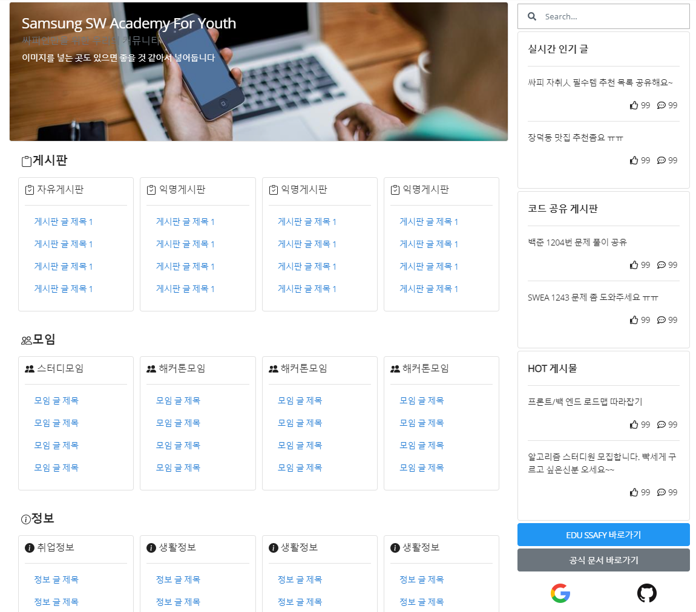
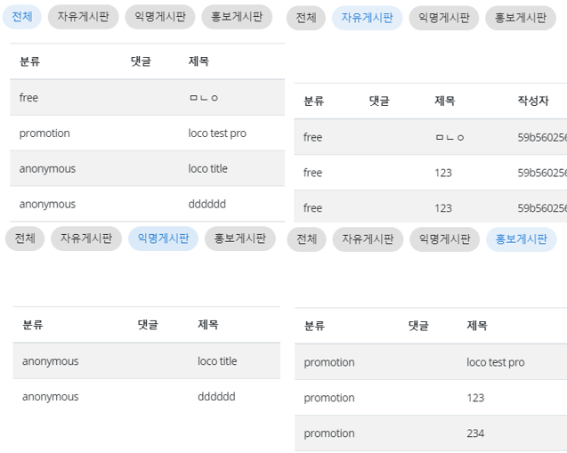
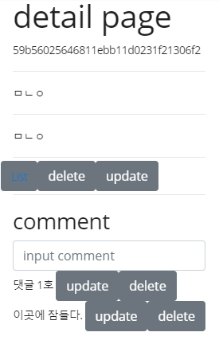
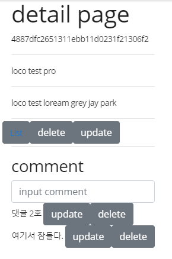

# ✨Today I Developed🤞


### ✔개발목표

```
-메인 사이드바 디자인 조정
-커뮤니티/정보 게시판 컴포넌트 전환(<component v-bind:is="compName">)
-comment axios 손보기
```


### 👌개발 진행 상황

1. 메인 사이드바 디자인 조정




2. Community & Information SPA에 맞게 컴포넌트 전환

```
CommunityMain과 InformationMain 그 자체에서 본인의 컴포넌트를 부르면 stacksize초과하여 오류발생한다.
`All.vue` 를 만들어 해당 메인 카테고리의 모든 게시물을 가져오는 Axios를 달았다.
CommunityMain과 InformationMain 에서는 컴포넌트를 갈아 끼워주는 역할만 담당한다.
```




3. comment Axios 변경사항

```javascript
// 기존 
모든 Article에 대한 댓글 가져옴
function axiosReadComment(success, fail) {
  instance
    .get(`/comment/`)
    .then(success)
    .catch(fail);
}

// 현재
해당 Aritlce에 대한 댓글만 가져옴
function axiosReadComment(articleId, success, fail) {
  instance
    .get(`/comment/${articleId}`)
    .then(success)
    .catch(fail);
}
```





### 🤷‍♂️개발이슈

```
.
```


### 🐱‍🚀향후 개발 계획

```
- 글쓰기 페이지 / 디테일 페이지 / 컴포넌트 디자인 조정
- firestore 학습
```

