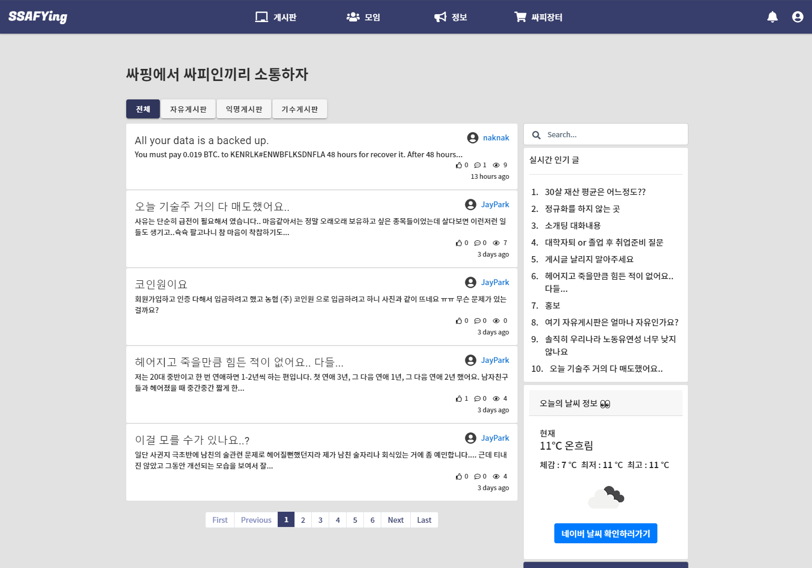
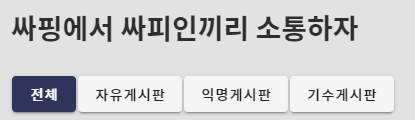
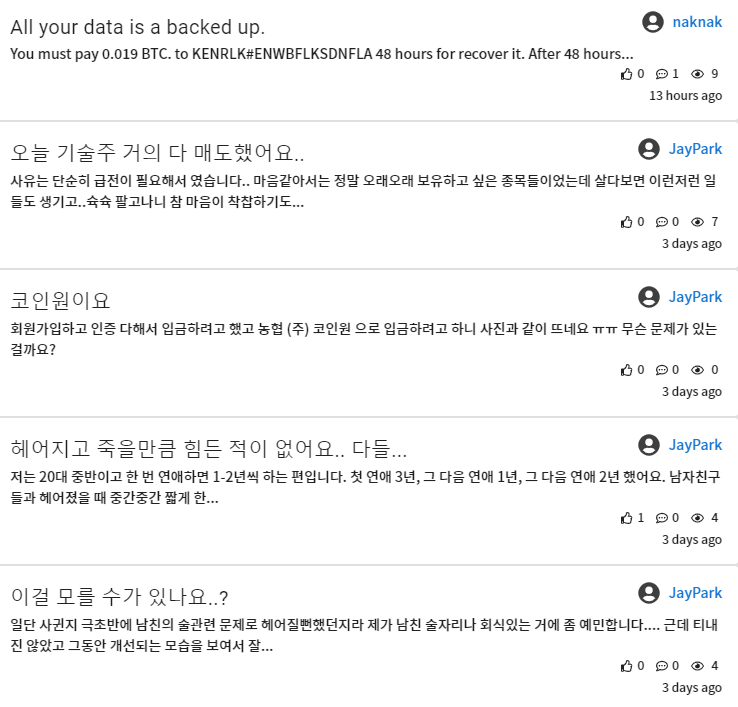
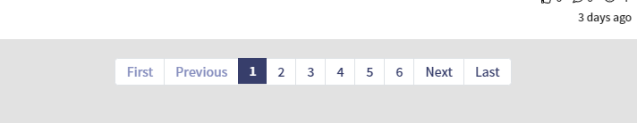
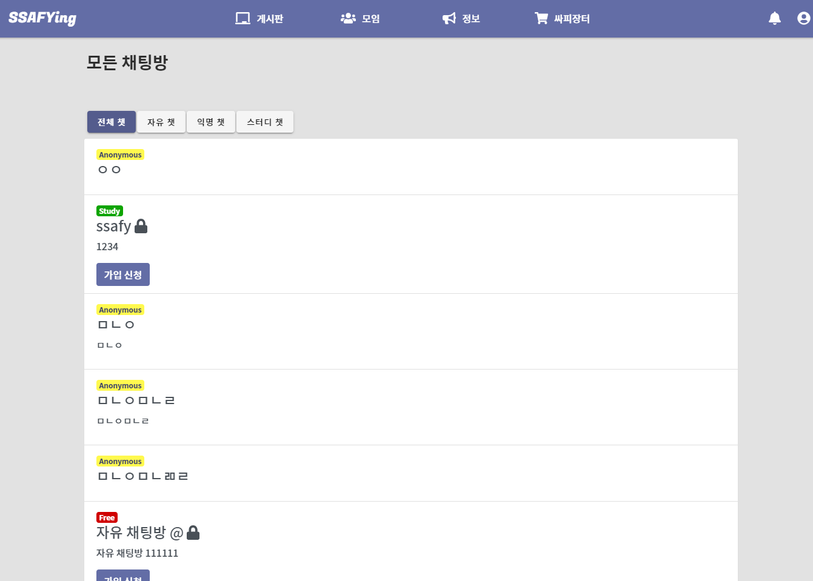
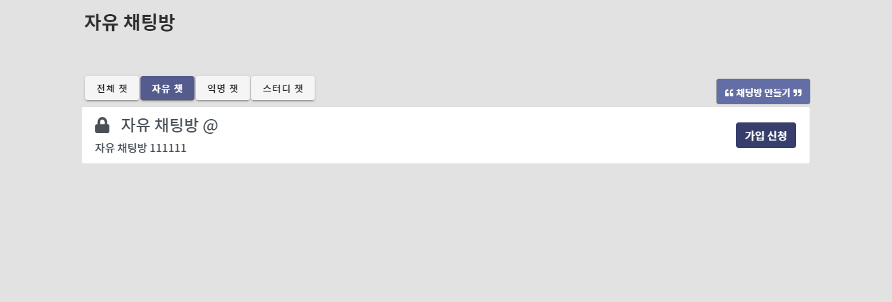
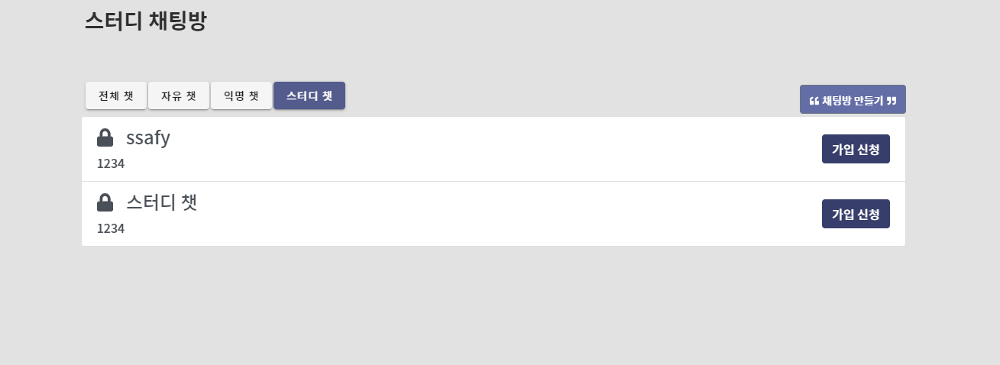
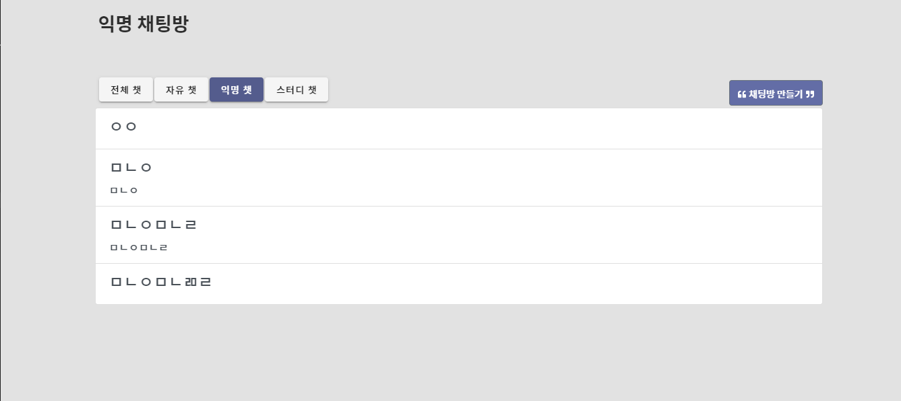

## 게시판 Style 변경사항

> 전체적으로 가시성 + 색의 통일성을 지키면서 style변경

- 게시판 전체 화면

- community__header
  - 가시성을 위해 margin 조정
  - link 버튼들 커스터마이징
  - active되면 색 반전

- community__contents
  - 전체적으로 font-size 축소
  - 우측 아래 icon크기/ timezone과 분리

- pagination 색 커스터마이징

## 채팅방 style추가

- 전체
  - 각 컴포넌트별 뱃지
  - 제목/소개
  - 잠금방은 가입신청버튼 추가

- 자유/스터디

- 익명
  - 잠금버튼 없이 제목만 적어도 생성가능

